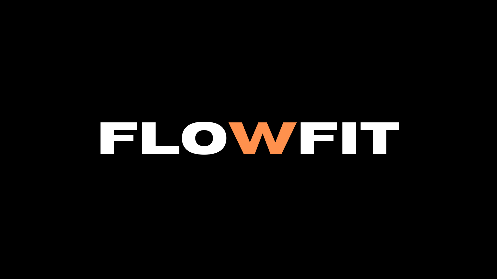

# FlowFit - Bootcamp Project

FlowFit is a project developed during the bootcamp, focused on resolving a real problem. The goal of this project is to help a especific gym in Portugal, Aveiro, but can also work in every other gym.

## 📌 Tecnologias Utilizadas

- **Frontend:** [Ex: HTML, CSS, Javascript]
- **Backend:** [Ex: Java, Spring Boot, ]
- **Banco de Dados:** [Ex: MySQL]
- **Outras Ferramentas:** [Ex: OpenAI API]

